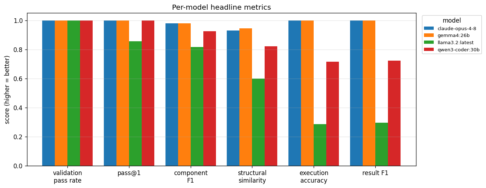
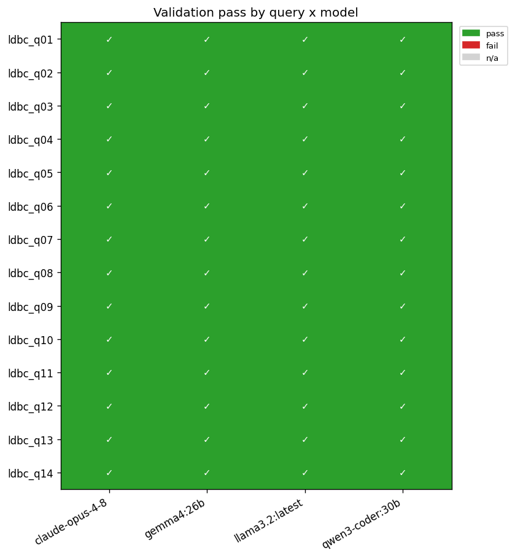
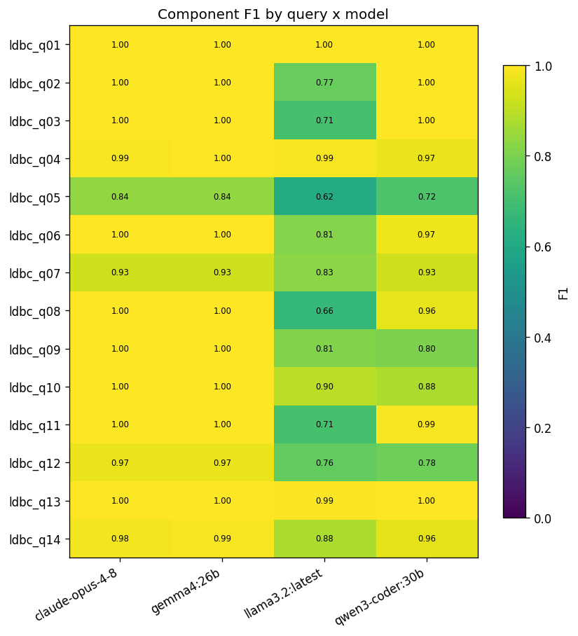
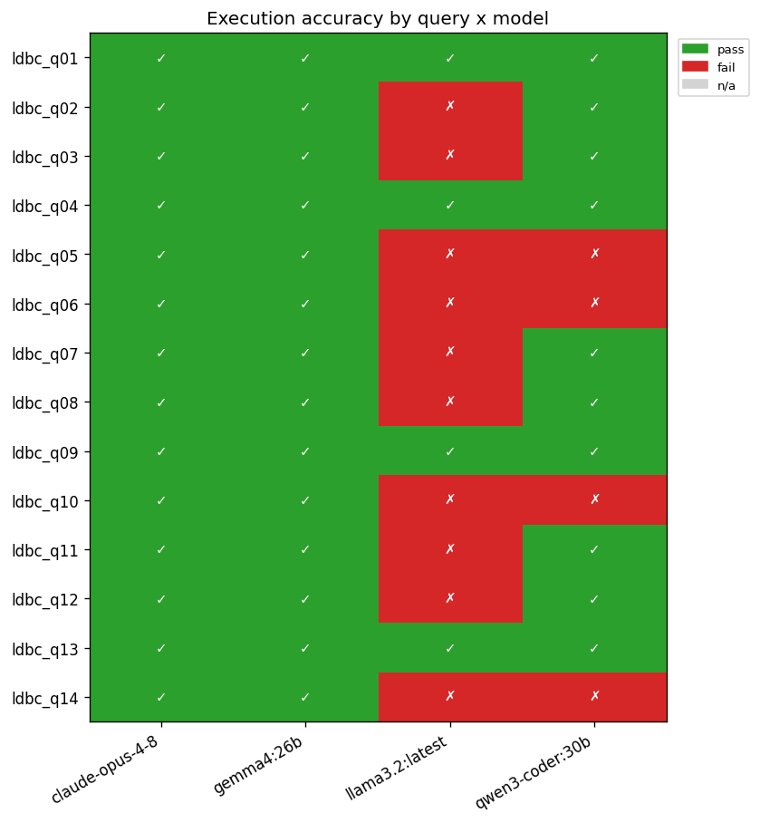
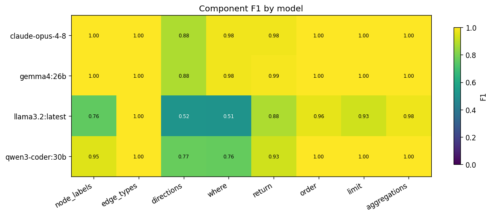
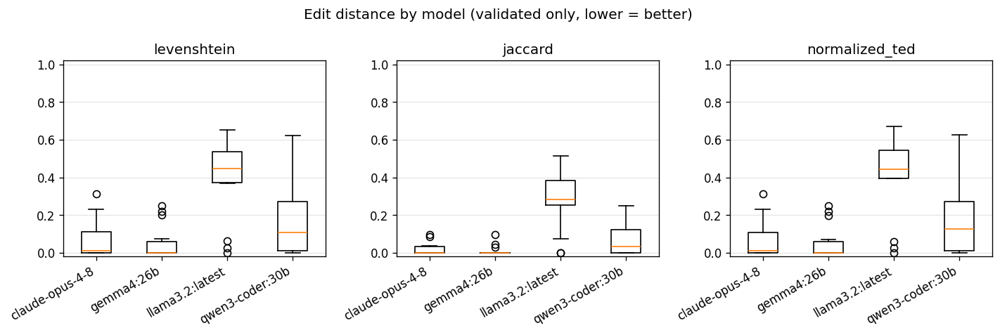
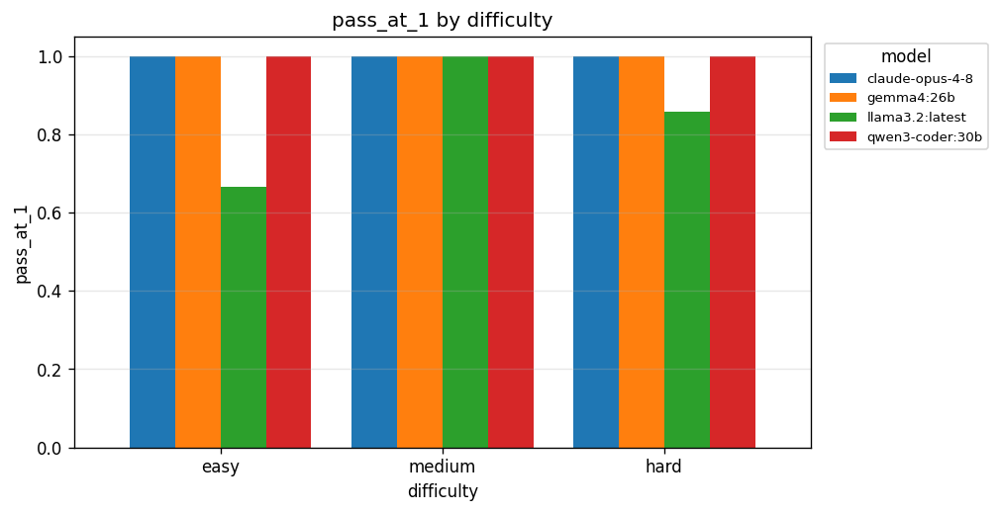

# rows2graph evaluation report

Generated: 2026-07-01T18:32:47

Models under evaluation: **claude-opus-4-8, gemma4:26b, llama3.2:latest, qwen3-coder:30b**

Total translations: **56** (56 validated)

Total tokens: **206,331** input / **27,837** output, approx **$0.36** USD

## Headline

| dataset   | target   | model           |   validation_pass_rate |   pass@1 |   component_f1 |   normalized_ted |   execution_accuracy |   result_f1 |
|-----------|----------|-----------------|------------------------|----------|----------------|------------------|----------------------|-------------|
| ldbc      | cypher   | claude-opus-4-8 |                  1.000 |    1.000 |          0.979 |            0.071 |                1.000 |       1.000 |
| ldbc      | cypher   | gemma4:26b      |                  1.000 |    1.000 |          0.980 |            0.054 |                1.000 |       1.000 |
| ldbc      | cypher   | llama3.2:latest |                  1.000 |    0.857 |          0.817 |            0.402 |                0.286 |       0.294 |
| ldbc      | cypher   | qwen3-coder:30b |                  1.000 |    1.000 |          0.926 |            0.178 |                0.714 |       0.723 |

## Stratified by dataset x target x model

| dataset   | target   | model           |   validation_passed |   pass_at_1 |   component_f1_overall |   normalized_ted |   execution_accuracy |   result_f1 |
|-----------|----------|-----------------|---------------------|-------------|------------------------|------------------|----------------------|-------------|
| ldbc      | cypher   | claude-opus-4-8 |               1.000 |       1.000 |                  0.979 |            0.071 |                1.000 |       1.000 |
| ldbc      | cypher   | gemma4:26b      |               1.000 |       1.000 |                  0.980 |            0.054 |                1.000 |       1.000 |
| ldbc      | cypher   | llama3.2:latest |               1.000 |       0.857 |                  0.817 |            0.402 |                0.286 |       0.294 |
| ldbc      | cypher   | qwen3-coder:30b |               1.000 |       1.000 |                  0.926 |            0.178 |                0.714 |       0.723 |

## Stratified by difficulty

| difficulty   |   validation_passed |   pass_at_1 |   component_f1_overall |   normalized_ted |   execution_accuracy |   result_f1 |
|--------------|---------------------|-------------|------------------------|------------------|----------------------|-------------|
| easy         |               1.000 |       0.917 |                  0.956 |            0.079 |                0.833 |       0.833 |
| medium       |               1.000 |       1.000 |                  0.926 |            0.238 |                0.688 |       0.688 |
| hard         |               1.000 |       0.964 |                  0.912 |            0.183 |                0.750 |       0.759 |

## Component F1 breakdown (per model)

| model           |   f1_node_labels |   f1_edge_types |   f1_directions |   f1_where |   f1_return |   f1_order |   f1_limit |   f1_aggregations |
|-----------------|------------------|-----------------|-----------------|------------|-------------|------------|------------|-------------------|
| claude-opus-4-8 |            1.000 |           1.000 |           0.875 |      0.979 |       0.978 |      1.000 |      1.000 |             1.000 |
| gemma4:26b      |            1.000 |           1.000 |           0.875 |      0.979 |       0.987 |      1.000 |      1.000 |             1.000 |
| llama3.2:latest |            0.758 |           1.000 |           0.517 |      0.514 |       0.878 |      0.962 |      0.929 |             0.976 |
| qwen3-coder:30b |            0.950 |           1.000 |           0.767 |      0.765 |       0.926 |      1.000 |      1.000 |             1.000 |

## Cost & latency (per model)

| model           |   mean_duration_s |   total_cost_usd |   mean_iterations |
|-----------------|-------------------|------------------|-------------------|
| claude-opus-4-8 |             2.982 |            0.364 |             1.000 |
| gemma4:26b      |            25.378 |            0.000 |             1.000 |
| llama3.2:latest |             7.470 |            0.000 |             1.286 |
| qwen3-coder:30b |             5.933 |            0.000 |             1.000 |

## Figures

## Error taxonomy (fill in manually)

Categories: schema_error, hallucination, direction_error, predicate_error, projection_error, aggregation_error, join_to_path_error, other.

|   index | dataset   | target   | model           | query_id   | difficulty   | validation_passed   |   component_f1_overall |   normalized_ted | category   | notes   |
|---------|-----------|----------|-----------------|------------|--------------|---------------------|------------------------|------------------|------------|---------|
|       0 | ldbc      | cypher   | llama3.2:latest | ldbc_q02   | easy         | True                |                   0.77 |             0.48 |            |         |
|       1 | ldbc      | cypher   | llama3.2:latest | ldbc_q03   | easy         | True                |                   0.71 |             0.46 |            |         |
|       2 | ldbc      | cypher   | llama3.2:latest | ldbc_q05   | hard         | True                |                   0.62 |             0.60 |            |         |
|       3 | ldbc      | cypher   | qwen3-coder:30b | ldbc_q05   | hard         | True                |                   0.72 |             0.62 |            |         |
|       4 | ldbc      | cypher   | llama3.2:latest | ldbc_q06   | medium       | True                |                   0.81 |             0.39 |            |         |
|       5 | ldbc      | cypher   | qwen3-coder:30b | ldbc_q06   | medium       | True                |                   0.97 |             0.17 |            |         |
|       6 | ldbc      | cypher   | llama3.2:latest | ldbc_q07   | medium       | True                |                   0.83 |             0.47 |            |         |
|       7 | ldbc      | cypher   | llama3.2:latest | ldbc_q08   | hard         | True                |                   0.66 |             0.67 |            |         |
|       8 | ldbc      | cypher   | llama3.2:latest | ldbc_q10   | hard         | True                |                   0.90 |             0.40 |            |         |
|       9 | ldbc      | cypher   | qwen3-coder:30b | ldbc_q10   | hard         | True                |                   0.88 |             0.05 |            |         |
|      10 | ldbc      | cypher   | llama3.2:latest | ldbc_q11   | hard         | True                |                   0.71 |             0.42 |            |         |
|      11 | ldbc      | cypher   | llama3.2:latest | ldbc_q12   | hard         | True                |                   0.76 |             0.57 |            |         |
|      12 | ldbc      | cypher   | llama3.2:latest | ldbc_q14   | medium       | True                |                   0.88 |             0.66 |            |         |
|      13 | ldbc      | cypher   | qwen3-coder:30b | ldbc_q14   | medium       | True                |                   0.96 |             0.10 |            |         |

## Execution-metric caveats

Oracle = gold SQL on Postgres vs generated query on the graph DB (multiset compare).

- Date reconciliation: Neo4j stores creationDate/birthday/joinDate as native temporal types (DateTime/Date) while Postgres uses timestamp/date. The comparator canonicalises date columns (identified from the Postgres oracle) to epoch-millis on both sides (Neo4j temporals via .to_native()), so queries that return a date compare correctly.

- Date predicates: with native temporal storage, datetime(...) predicates match, so the former shared q02/q07 failures are resolved. A residual q02 miss for one model comes from translating a timestamp filter with date(...) instead of datetime(...): comparing a datetime property to a date literal returns null in Neo4j (a genuine translation type-mismatch, not a storage artifact).

- Vacuous matches: when both stores return 0 rows, execution_accuracy is 1.0 even if the generated query has a latent bug.

## Out of scope (this pass)

- TPC-H, AQL, Gremlin, and additional models (matrix extension points).
