# rows2graph evaluation report

Generated: 2026-07-02T08:04:40

Models under evaluation: **claude-opus-4-8, gemma4:26b, llama3.2:latest, qwen3-coder:30b**

Targets: **SQL -> Cypher, SQL -> AQL**

Total translations: **112** (110 validated)

Total tokens: **500,878** input / **78,824** output, approx **$0.83** USD

Results are reported per target below; Cypher and AQL are never combined in one table or figure.

## SQL -> Cypher

Translations: **56** (56 validated)

### Headline (per model)

| model           |   validation_pass_rate |   pass@1 |   component_f1 |   normalized_ted |   execution_accuracy |   result_f1 |
|-----------------|------------------------|----------|----------------|------------------|----------------------|-------------|
| claude-opus-4-8 |                  1.000 |    1.000 |          0.979 |            0.071 |                1.000 |       1.000 |
| gemma4:26b      |                  1.000 |    1.000 |          0.980 |            0.054 |                1.000 |       1.000 |
| llama3.2:latest |                  1.000 |    0.857 |          0.817 |            0.402 |                0.214 |       0.223 |
| qwen3-coder:30b |                  1.000 |    1.000 |          0.926 |            0.178 |                0.571 |       0.580 |

### Stratified by difficulty

| difficulty   |   validation_passed |   pass_at_1 |   component_f1_overall |   normalized_ted |   execution_accuracy |   result_f1 |
|--------------|---------------------|-------------|------------------------|------------------|----------------------|-------------|
| easy         |               1.000 |       0.917 |                  0.956 |            0.079 |                0.833 |       0.833 |
| medium       |               1.000 |       1.000 |                  0.926 |            0.238 |                0.562 |       0.562 |
| hard         |               1.000 |       0.964 |                  0.912 |            0.183 |                0.714 |       0.723 |

### Component F1 breakdown (per model)

| model           |   f1_node_labels |   f1_edge_types |   f1_directions |   f1_where |   f1_return |   f1_order |   f1_limit |   f1_aggregations |
|-----------------|------------------|-----------------|-----------------|------------|-------------|------------|------------|-------------------|
| claude-opus-4-8 |            1.000 |           1.000 |           0.875 |      0.979 |       0.978 |      1.000 |      1.000 |             1.000 |
| gemma4:26b      |            1.000 |           1.000 |           0.875 |      0.979 |       0.987 |      1.000 |      1.000 |             1.000 |
| llama3.2:latest |            0.758 |           1.000 |           0.517 |      0.514 |       0.878 |      0.962 |      0.929 |             0.976 |
| qwen3-coder:30b |            0.950 |           1.000 |           0.767 |      0.765 |       0.926 |      1.000 |      1.000 |             1.000 |

### Cost & latency (per model)

| model           |   mean_duration_s |   total_cost_usd |   mean_iterations |
|-----------------|-------------------|------------------|-------------------|
| claude-opus-4-8 |             2.982 |            0.364 |             1.000 |
| gemma4:26b      |            25.378 |            0.000 |             1.000 |
| llama3.2:latest |             7.470 |            0.000 |             1.286 |
| qwen3-coder:30b |             5.933 |            0.000 |             1.000 |

### Figures

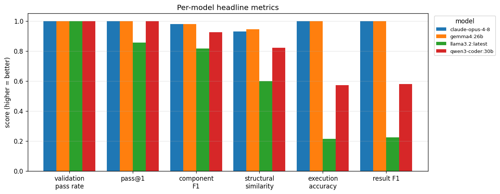

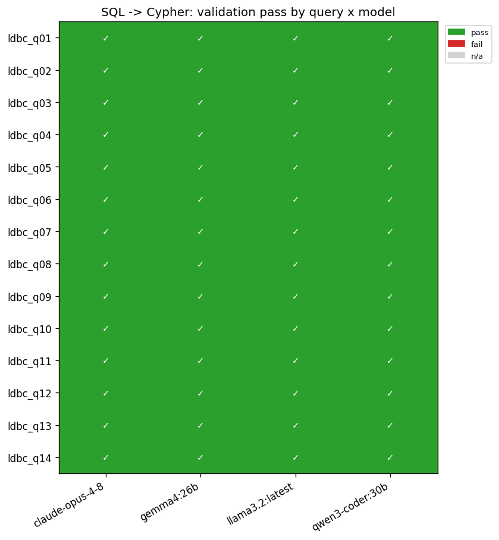

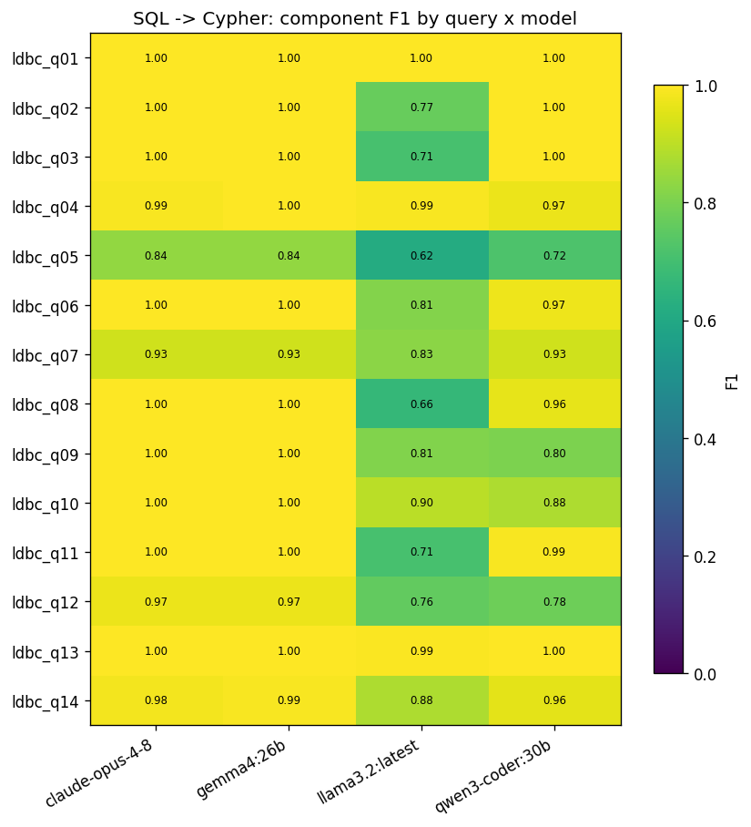

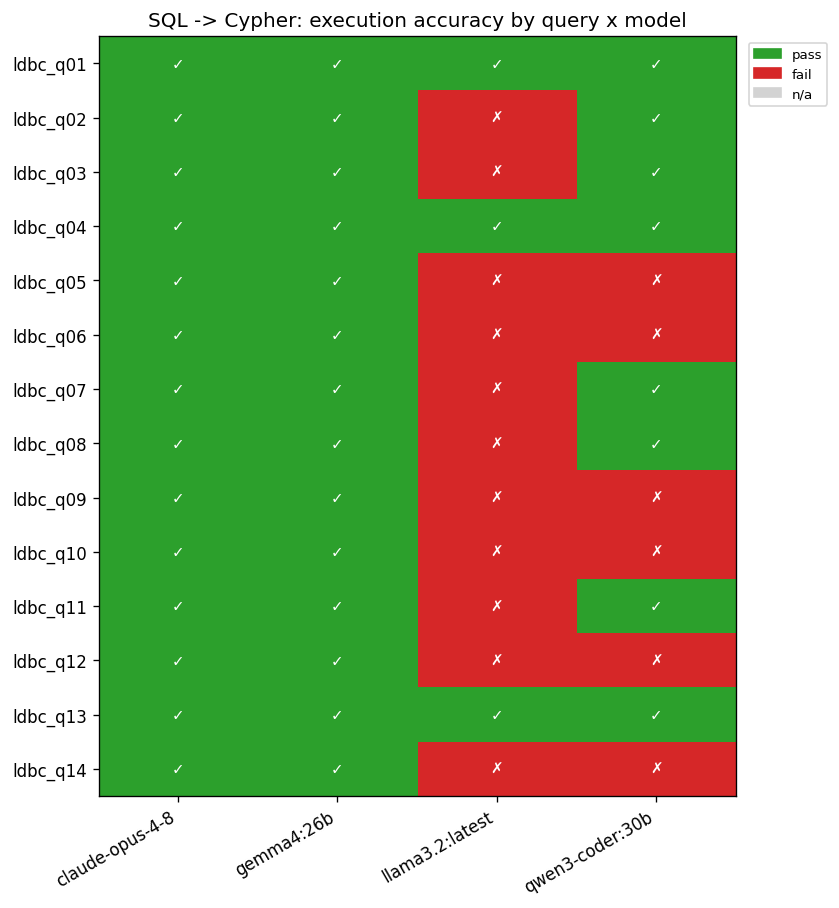

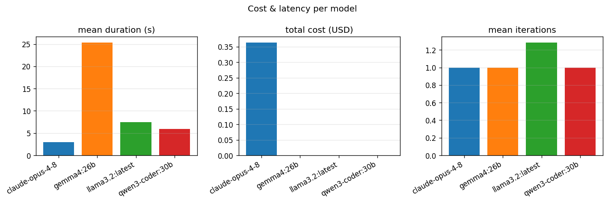

### Error taxonomy (fill in manually)

Categories: schema_error, hallucination, direction_error, predicate_error, projection_error, aggregation_error, join_to_path_error, other.

|   index | model           | query_id   | difficulty   | validation_passed   |   component_f1_overall |   normalized_ted | category   | notes   |
|---------|-----------------|------------|--------------|---------------------|------------------------|------------------|------------|---------|
|       0 | llama3.2:latest | ldbc_q02   | easy         | True                |                   0.77 |             0.48 |            |         |
|       1 | llama3.2:latest | ldbc_q03   | easy         | True                |                   0.71 |             0.46 |            |         |
|       2 | llama3.2:latest | ldbc_q05   | hard         | True                |                   0.62 |             0.60 |            |         |
|       3 | qwen3-coder:30b | ldbc_q05   | hard         | True                |                   0.72 |             0.62 |            |         |
|       4 | llama3.2:latest | ldbc_q06   | medium       | True                |                   0.81 |             0.39 |            |         |
|       5 | qwen3-coder:30b | ldbc_q06   | medium       | True                |                   0.97 |             0.17 |            |         |
|       6 | llama3.2:latest | ldbc_q07   | medium       | True                |                   0.83 |             0.47 |            |         |
|       7 | llama3.2:latest | ldbc_q08   | hard         | True                |                   0.66 |             0.67 |            |         |
|       8 | llama3.2:latest | ldbc_q09   | medium       | True                |                   0.81 |             0.42 |            |         |
|       9 | qwen3-coder:30b | ldbc_q09   | medium       | True                |                   0.80 |             0.38 |            |         |
|      10 | llama3.2:latest | ldbc_q10   | hard         | True                |                   0.90 |             0.40 |            |         |
|      11 | qwen3-coder:30b | ldbc_q10   | hard         | True                |                   0.88 |             0.05 |            |         |
|      12 | llama3.2:latest | ldbc_q11   | hard         | True                |                   0.71 |             0.42 |            |         |
|      13 | llama3.2:latest | ldbc_q12   | hard         | True                |                   0.76 |             0.57 |            |         |
|      14 | qwen3-coder:30b | ldbc_q12   | hard         | True                |                   0.78 |             0.49 |            |         |
|      15 | llama3.2:latest | ldbc_q14   | medium       | True                |                   0.88 |             0.66 |            |         |
|      16 | qwen3-coder:30b | ldbc_q14   | medium       | True                |                   0.96 |             0.10 |            |         |

## SQL -> AQL

Translations: **56** (54 validated)

### Headline (per model)

| model           |   validation_pass_rate |   pass@1 |   component_f1 |   normalized_ted |   execution_accuracy |   result_f1 |
|-----------------|------------------------|----------|----------------|------------------|----------------------|-------------|
| claude-opus-4-8 |                  1.000 |    1.000 |          0.905 |            0.218 |                0.929 |       0.929 |
| gemma4:26b      |                  1.000 |    0.929 |          0.897 |            0.218 |                0.929 |       0.929 |
| llama3.2:latest |                  0.857 |    0.500 |          0.572 |            0.398 |                0.000 |       0.000 |
| qwen3-coder:30b |                  1.000 |    1.000 |          0.855 |            0.297 |                0.500 |       0.500 |

### Stratified by difficulty

| difficulty   |   validation_passed |   pass_at_1 |   component_f1_overall |   normalized_ted |   execution_accuracy |   result_f1 |
|--------------|---------------------|-------------|------------------------|------------------|----------------------|-------------|
| easy         |               1.000 |       1.000 |                  0.938 |            0.038 |                0.750 |       0.750 |
| medium       |               0.938 |       0.938 |                  0.818 |            0.315 |                0.562 |       0.562 |
| hard         |               0.964 |       0.750 |                  0.745 |            0.369 |                0.536 |       0.536 |

### Component F1 breakdown (per model)

| model           |   f1_node_labels |   f1_edge_types |   f1_directions |   f1_where |   f1_return |   f1_order |   f1_limit |   f1_aggregations |
|-----------------|------------------|-----------------|-----------------|------------|-------------|------------|------------|-------------------|
| claude-opus-4-8 |            0.695 |           1.000 |           0.940 |      0.885 |       0.864 |      0.855 |      1.000 |             1.000 |
| gemma4:26b      |            0.695 |           1.000 |           0.964 |      0.841 |       0.908 |      0.911 |      1.000 |             0.857 |
| llama3.2:latest |            0.000 |           0.214 |           0.624 |      0.504 |       0.832 |      0.762 |      0.786 |             0.857 |
| qwen3-coder:30b |            0.667 |           0.898 |           0.872 |      0.727 |       0.826 |      0.849 |      1.000 |             1.000 |

### Cost & latency (per model)

| model           |   mean_duration_s |   total_cost_usd |   mean_iterations |
|-----------------|-------------------|------------------|-------------------|
| claude-opus-4-8 |             2.938 |            0.469 |             1.000 |
| gemma4:26b      |            37.576 |            0.000 |             1.071 |
| llama3.2:latest |            17.379 |            0.000 |             1.714 |
| qwen3-coder:30b |             5.921 |            0.000 |             1.000 |

### Figures

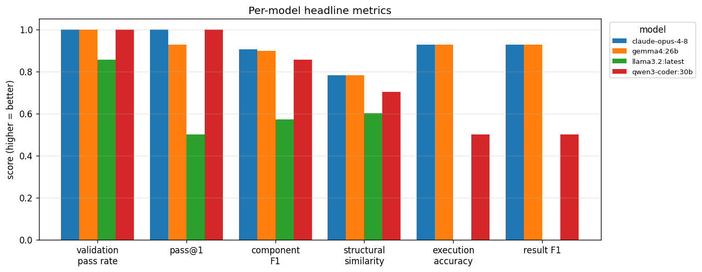

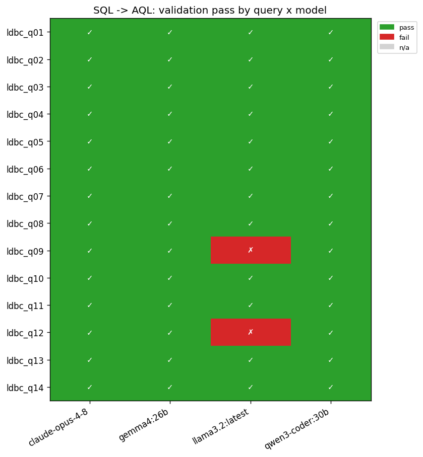

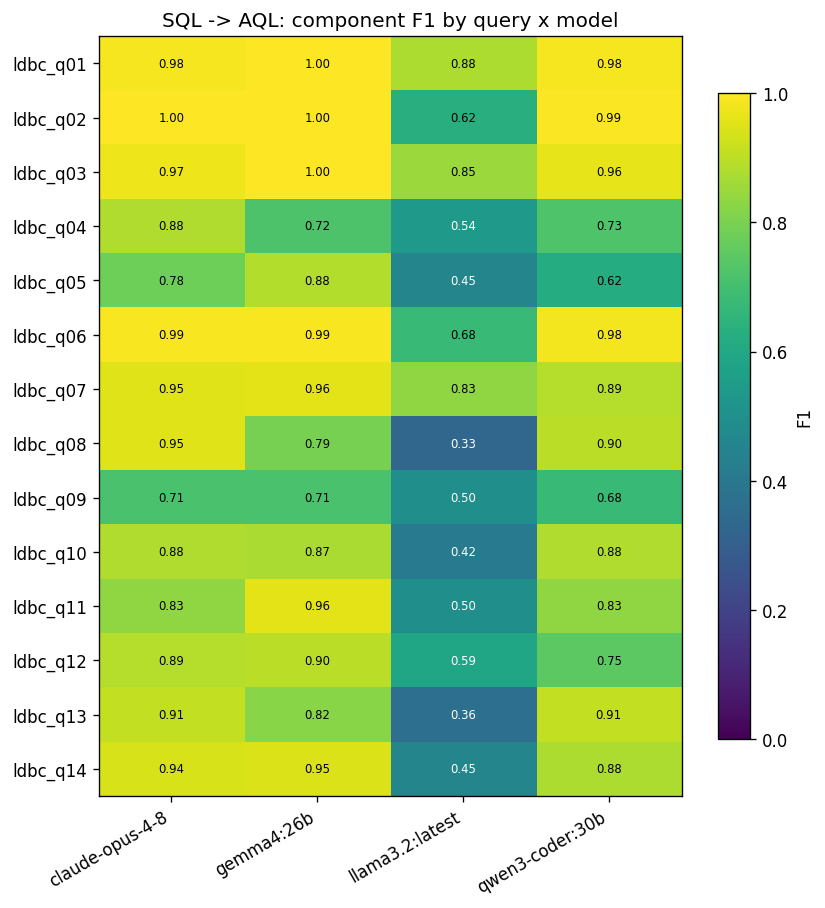

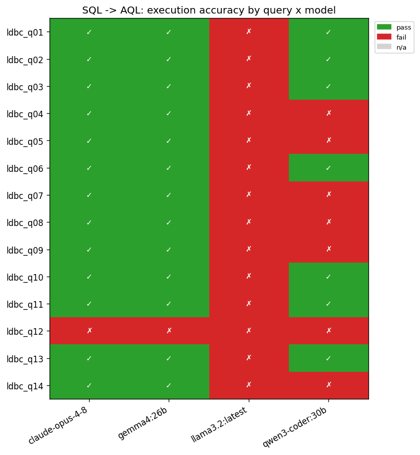

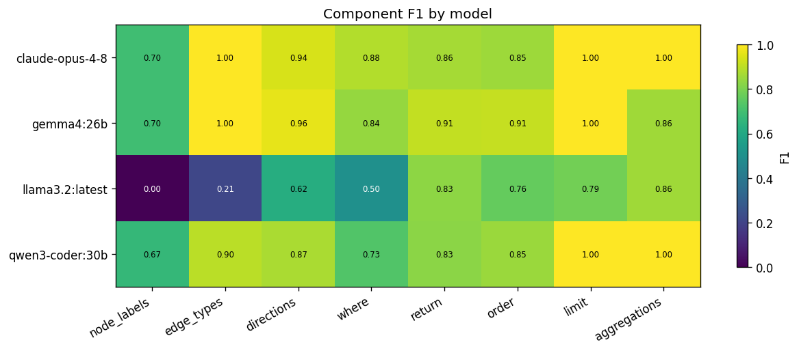

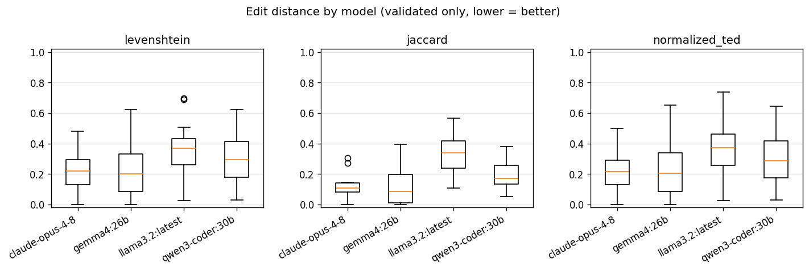

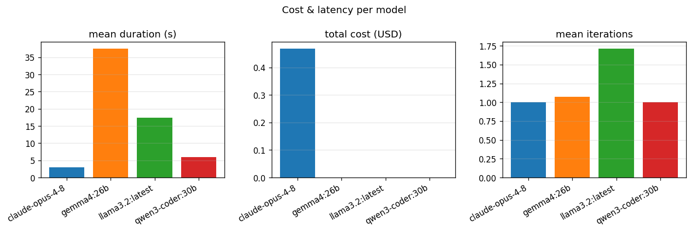

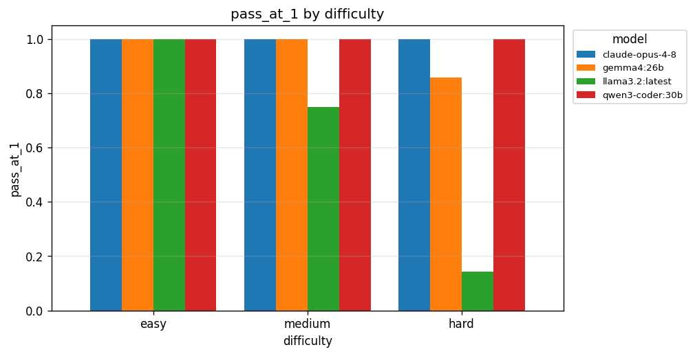

### Error taxonomy (fill in manually)

Categories: schema_error, hallucination, direction_error, predicate_error, projection_error, aggregation_error, join_to_path_error, other.

|   index | model           | query_id   | difficulty   | validation_passed   |   component_f1_overall |   normalized_ted | category   | notes   |
|---------|-----------------|------------|--------------|---------------------|------------------------|------------------|------------|---------|
|       0 | llama3.2:latest | ldbc_q01   | easy         | True                |                   0.88 |             0.02 |            |         |
|       1 | llama3.2:latest | ldbc_q02   | easy         | True                |                   0.62 |             0.08 |            |         |
|       2 | llama3.2:latest | ldbc_q03   | easy         | True                |                   0.85 |             0.06 |            |         |
|       3 | llama3.2:latest | ldbc_q04   | hard         | True                |                   0.54 |             0.39 |            |         |
|       4 | qwen3-coder:30b | ldbc_q04   | hard         | True                |                   0.73 |             0.65 |            |         |
|       5 | llama3.2:latest | ldbc_q05   | hard         | True                |                   0.45 |             0.54 |            |         |
|       6 | qwen3-coder:30b | ldbc_q05   | hard         | True                |                   0.62 |             0.54 |            |         |
|       7 | llama3.2:latest | ldbc_q06   | medium       | True                |                   0.68 |             0.44 |            |         |
|       8 | llama3.2:latest | ldbc_q07   | medium       | True                |                   0.83 |             0.34 |            |         |
|       9 | qwen3-coder:30b | ldbc_q07   | medium       | True                |                   0.89 |             0.25 |            |         |
|      10 | llama3.2:latest | ldbc_q08   | hard         | True                |                   0.33 |             0.74 |            |         |
|      11 | qwen3-coder:30b | ldbc_q08   | hard         | True                |                   0.90 |             0.29 |            |         |
|      12 | llama3.2:latest | ldbc_q09   | medium       | False               |                   0.50 |             0.53 |            |         |
|      13 | qwen3-coder:30b | ldbc_q09   | medium       | True                |                   0.68 |             0.45 |            |         |
|      14 | llama3.2:latest | ldbc_q10   | hard         | True                |                   0.42 |             0.38 |            |         |
|      15 | llama3.2:latest | ldbc_q11   | hard         | True                |                   0.50 |             0.32 |            |         |
|      16 | claude-opus-4-8 | ldbc_q12   | hard         | True                |                   0.89 |             0.22 |            |         |
|      17 | gemma4:26b      | ldbc_q12   | hard         | True                |                   0.90 |             0.19 |            |         |
|      18 | llama3.2:latest | ldbc_q12   | hard         | False               |                   0.59 |             0.63 |            |         |
|      19 | qwen3-coder:30b | ldbc_q12   | hard         | True                |                   0.75 |             0.50 |            |         |
|      20 | llama3.2:latest | ldbc_q13   | hard         | True                |                   0.36 |             0.36 |            |         |
|      21 | llama3.2:latest | ldbc_q14   | medium       | True                |                   0.45 |             0.73 |            |         |
|      22 | qwen3-coder:30b | ldbc_q14   | medium       | True                |                   0.88 |             0.31 |            |         |

## Execution-metric caveats

Oracle = gold SQL on Postgres vs generated query on the graph DB (multiset compare).

- Query timeout: each generated query runs under a **180s per-query ceiling** (`EVAL_QUERY_TIMEOUT`); a query killed at the ceiling scores 0 even if it would return the correct rows given more time. This was raised from an earlier 120s so a correct-but-slow AQL translation is not scored as a failure for engine speed rather than translation quality. Verified example: `claude-opus-4-8` q05 (AQL) is a **correct** translation but runs ~123s -- it materialises full documents into arrays instead of counting with `RETURN 1`, so it was killed at 120s and passes at 180s (execution accuracy 0.857 -> 0.929, tied with gemma4:26b). `translated_runtime_s` still records per-query speed, so slow-but-correct queries stay visible.

- Date reconciliation: Neo4j stores creationDate/birthday/joinDate as native temporals; ArangoDB stores them as ISO-8601 strings; Postgres uses timestamp/date. The comparator canonicalises the date columns (identified from the Postgres oracle) to epoch-millis on all sides.

- AQL empty text: ArangoDB returns absent optional text (e.g. image-post content) as "" where Postgres has NULL; the AQL path reconciles the two.

- Unified edges: AQL execution needs the mapping-aligned SCREAMING_SNAKE edge collections built by evaluation/build_arango_unified_edges.py; without them AQL traversals error and score 0.

- Vacuous matches: when both stores return 0 rows, execution_accuracy is 1.0 even if the generated query has a latent bug.

## Out of scope (this pass)

- TPC-H (needs a Postgres oracle), Gremlin, and additional models (matrix extension points).
